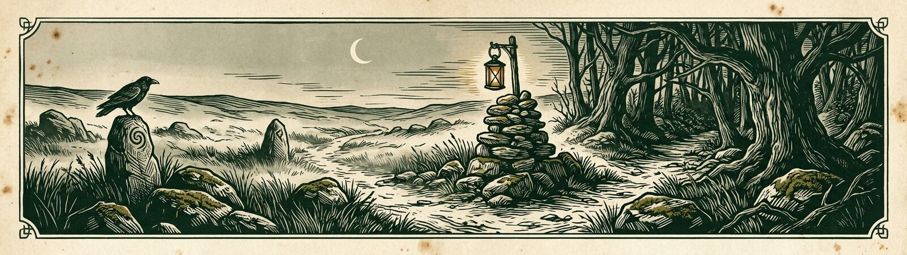
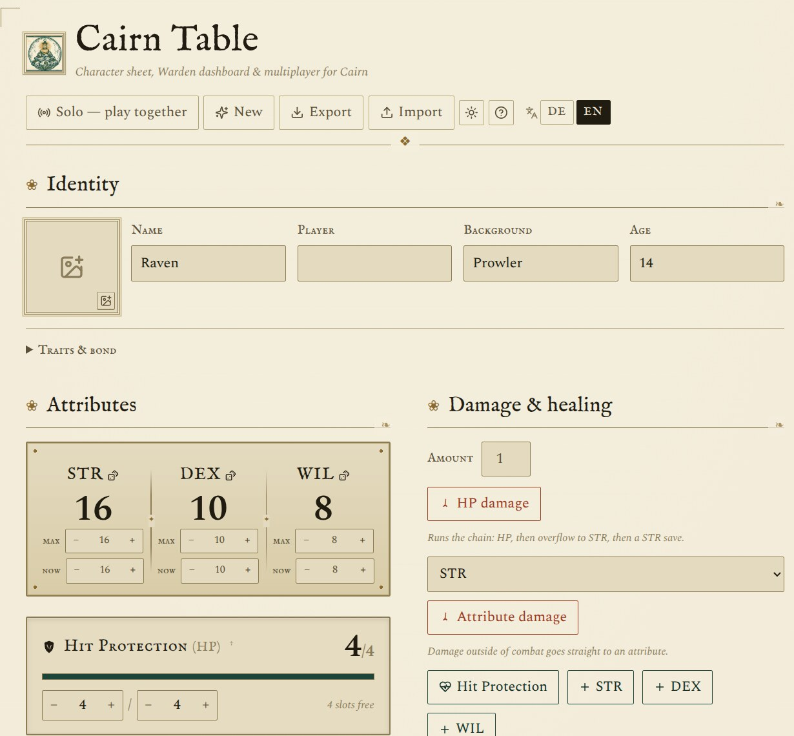
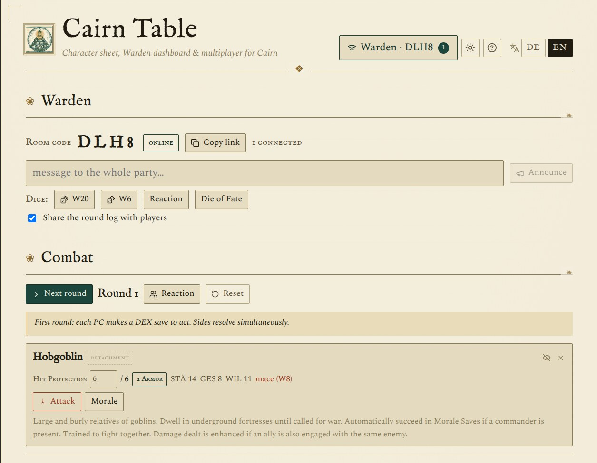

<div align="center">

<sub>[English](README.md) · Deutsch</sub>



# Cairn Table

**Charakterbogen · Warden-Dashboard · serverloser Echtzeit-Multiplayer**
für das Pen-&-Paper-Rollenspiel **[Cairn](https://cairnrpg.com/)** (2nd Edition) —
alles im Browser, ohne Anmeldung.

<sub>zweisprachig DE / EN · alles bleibt lokal im Browser · kein Konto, kein Server</sub>

### [**▶ Cairn Table spielen**](https://dondavis-vibe.github.io/cairn-table/)

</div>

---

Öffne [die Seite](https://dondavis-vibe.github.io/cairn-table/), würfle dir eine:n Abenteurer:in zusammen und leg los. Zu mehreren
eröffnet der Warden einen Raum und teilt einen Link — die Verbindung läuft direkt
zwischen den Browsern (WebRTC), ohne dass Spieldaten über einen Server laufen.

<p align="center">
  
  
</p>

## Für Spieler:innen

- **Charakterbogen** — STÄ / GES / WIL (3–18), Trefferschutz, Gold, Entbehrung,
  Narben, Alter, Merkmale, Bande, Omen. Alles wird automatisch im Browser gesichert.
- **Charaktererschaffung** nach Cairn 2e — alle **20 Hintergründe** mit fester
  Startausrüstung und W6-Untertabellen, 3W6 je Attribut (zwei tauschbar),
  TP 1W6, Gold 3W6, 8 Merkmalstabellen, Bande & Omen.
- **10-Slot-Inventar per Drag & Drop** — vier am Körper, sechs im Rucksack; 1- und
  2-Platz-Gegenstände, petty (kein Slot), Nutzungspunkte, Erschöpfung als Slot-Karte.
- **Würfeln** — Rettungswurf (W20 ≤ Attribut, 1 gelingt immer, 20 misslingt
  immer), Schadenswurf (Würfelwahl, beeinträchtigt / verstärkt, mehrere
  Angreifer, Rüstungsabzug), Schicksalswürfel. Automatische Schadenskette
  Rüstung → TP → STÄ → Rettungswurf → Narbe/Tod.
- **Rast** — kurze Rast stellt die TP voll her; Nachtruhe entfernt zusätzlich
  alle Erschöpfung; Wochenrast stellt auch Attribute und den kritischen
  Zustand wieder her.

## Für Wardens

- **Dashboard** — ein Gruppenüberblick über alle Spieler:innen auf einen
  Blick, der Rest in frei anordenbaren Panels, per Drag & Drop sortier- und
  verschiebbar.
- **Eingriffe pro Bogen** — Schaden (mit voller Kette), Heilen, Gold ±,
  Rettungswurf fordern, Erschöpfung, Entbehrung oder Panik, Rast auslösen,
  flüstern.
- **Geteiltes Runden-Log**, Ansagen und ein animierter Würfelteller (W20,
  W6, Reaktion, Schicksalswürfel) für den ganzen Tisch.
- **Kampf-Tracker** — Gegner aus dem **2e-Bestiarium (84 Kreaturen)** oder
  eigene gespeicherte Monster, TP-Verwaltung, Angriffswurf, Moral (WIL-RW),
  Abteilungen, Rundenzähler mit „Erste Runde: GES-Rettungswurf"-Hinweis.
- **Karte** — Bild laden, Figuren setzen (verbundene Spieler:innen per Klick,
  dazu Marker und aufgedeckte Gegner), Distanzen messen, Zauberradien
  einzeichnen und Nebel des Krieges steuern. Mehrere benannte Karten;
  alles bleibt im Browser des Wardens und übersteht einen Reload.
- **Tischmitte & Behälter** — ein geteilter Beute-Pool, dazu benannte
  Behälter (Maultier, Karren, Mietlinge) mit eigenem Slot-Limit und
  Ein-Klick-Übergabe an jede:n Spieler:in.
- **Generatoren** — Fremde oder Kleinode auf Zuruf auswürfeln.
- **Geheime Warden-Notizen** pro Spieler:in — nur lokal, nie gesendet.

## Zusammen spielen

Serverloser Multiplayer über WebRTC / PeerJS. Der Warden ist Host; Spieler:innen
treten per 4-Buchstaben-Code oder `?join`-Link bei. Reconnect und
Reload-Wiederherstellung sind eingebaut. Spieldaten laufen direkt und verschlüsselt
zwischen den Browsern — nur der Verbindungsaufbau nutzt den öffentlichen
PeerJS-Broker und Google-STUN.

## Entwickeln

```bash
npm install
npm run dev        # http://localhost:5173
npm run build      # -> dist/index.html  (portable Einzeldatei, viteSingleFile)
npm run preview
npm run lint       # oxlint
```

Push auf `main` baut und deployt über GitHub Actions auf GitHub Pages.

**Stack:** Vite + React 19 (plain JS, kein TypeScript), `@dnd-kit` fürs
Inventar-Raster, `peerjs` für den Multiplayer, `lucide-react` für Icons.
Schriften (IM Fell English, Spectral) selbst gehostet. Kein Backend, kein Konto.

## Regeldaten & Bilder

`src/data/*` ist aus dem offiziellen **Cairn-2e-SRD** von Yochai Gal abgeleitet
(**CC BY-SA 4.0**). Wirkungstexte sind zusammengefasst, nicht wörtlich übernommen.
Abgeleitete Regeltexte stehen dadurch ebenfalls unter CC BY-SA 4.0. Der volle
SRD-Klon unter `reference/` liegt nur lokal (per `.gitignore` ausgeschlossen).

Logo, Banner, Social-Card und Holzschnitt-Vignetten sind eigene KI-Generierungen
(Quellen in `img/`, nur lokal) — **kein** offizielles Cairn-Artwork.

## Rechtliches

[Impressum](public/impressum.html) · [Datenschutzerklärung](public/datenschutz.html)
— eigenständige Seiten. Der Kontaktblock des Impressums wird beim Deploy aus dem
Repository-Secret `IMPRESSUM_KONTAKT` eingesetzt (Vorlage:
[`.github/KONTAKT.beispiel.html`](.github/KONTAKT.beispiel.html)) und steht nicht
im öffentlichen Quellcode. Wer den Code forkt und selbst betreibt, braucht ein
eigenes Impressum.

## Lizenz

Code: **MIT** (`LICENSE`).

> *Based on Cairn by Yochai Gal, used under CC-BY-SA 4.0. Cairn Table is an independent,
> non-commercial fan tool and is not affiliated with Cairn RPG.*
